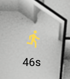

# Last-changed-element
Display when entity was last changed in home assistant picture element.



### Instalation
Add this repo to `HACS` and then go to `Configuration > Lovelace Dashboard > Resources` and add a new resource:

```
URL: /hacsfiles/last-changed-element/last-changed-element.js
Resource Type: Javascript Module
```

### Usage

Use it as a custom element inside a `picture-elements`.
```
elements:
   - type: state-icon
     entity: binary_sensor.my_occupancy
     style:
       left: 50%
       top: 45%
   - type: 'custom:last-changed-element'
     entity: binary_sensor.my_occupancy
     style:
       left: 50%
       top: 50%
image: /local/images/floorplan.svg
type: picture-elements
```
